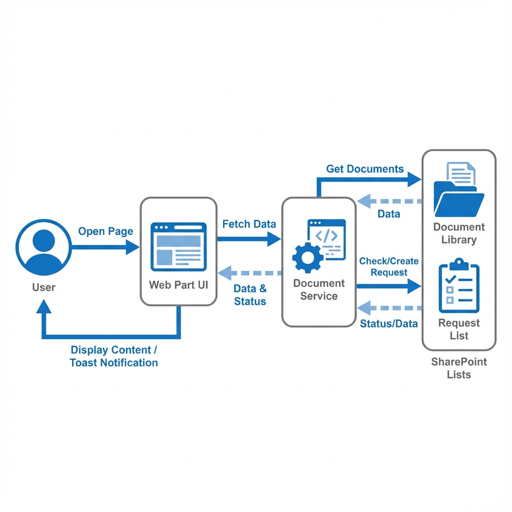
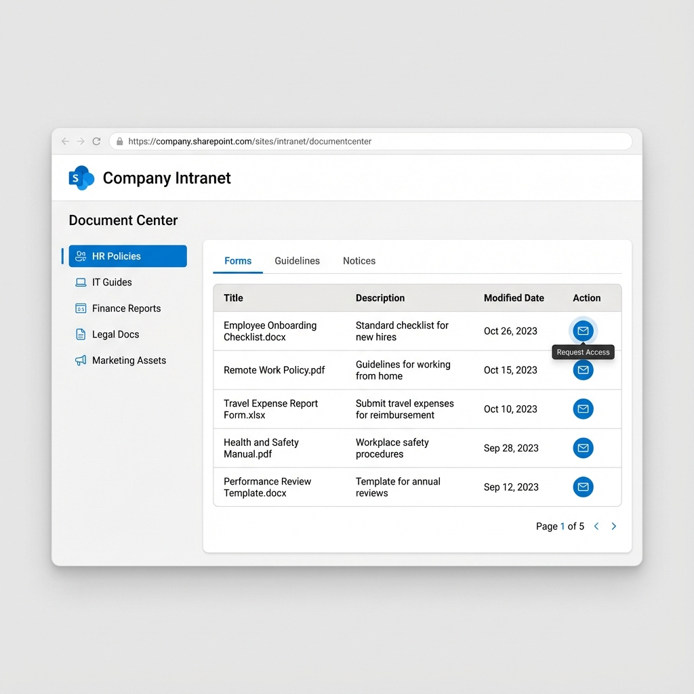
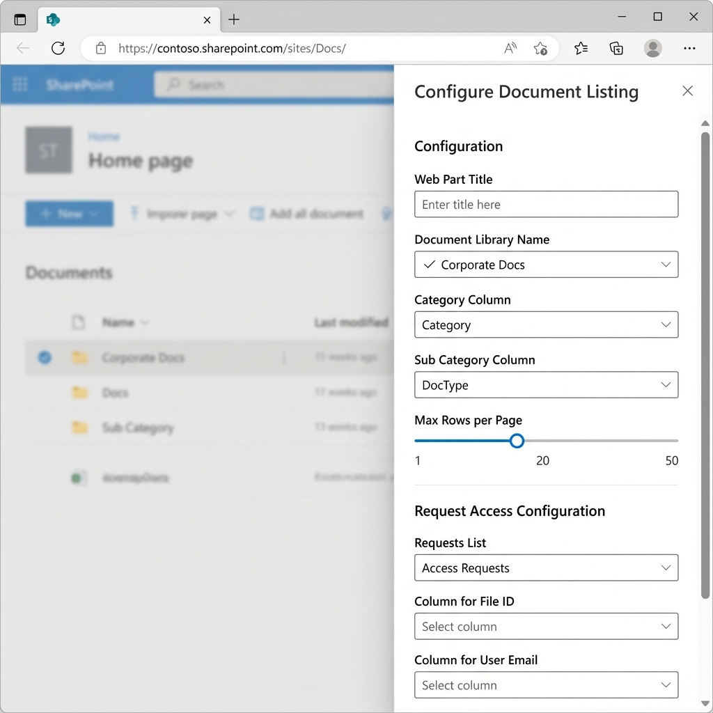

# Document Listing Web Part - Design Document

## 1. Overview
The **Document Listing Web Part** is a custom SharePoint Framework (SPFx) solution designed to provide a structured, user-friendly interface for browsing and accessing organization documents. It replaces standard list views with a curated experience featuring hierarchical navigation (Category > Sub-Category) and a request-access workflow for controlled documents.

## 2. Key Features

### Browsing & Navigation
- **Two-Level Hierarchy**:
  - **Primary Category (Sidebar)**: Users select a high-level bucket (e.g., "HR Policies", "Finance").
  - **Sub-Category (Tabs)**: Inside a category, users filter by specific types (e.g., "Forms", "Guidelines").
- **Dynamic Content**: The listing updates instantly without page reloads when navigation items are selected.
- **Sorting**: click-to-sort column headers for Title, Description, and Date.
- **Pagination**: Client-side pagination to handle large document sets efficiently (default 10 per page).

### Access Management
- **Request Access Action**: A "Mail" icon action button is available for every document.
- **Request Tracking**: Clicking the action submits a request to a backend SharePoint list, capturing the User's Email and the File ID.
- **Download Counting**: If configured, repeated requests for the same file by the same user increment a counter rather than spamming the list with duplicates.
- **Visual Feedback**: Toast notifications confirm successful requests or alert on errors.

### Customization & theming
- **Theme Aware**: Inherits colors (Primary, Neutral, Background) from the current SharePoint Site Theme.
- **Fully Configurable**: All column mappings and list targets are selectable via the Property Pane.

## 3. Architecture

### 3.1 Technology Stack
- **Framework**: SharePoint Framework (SPFx) v1.19+
- **Language**: TypeScript
- **Styling**: SCSS Modules
- **Data Access**: `spHttpClient` (SharePoint REST API)
- **Rendering**: Lightweight DOM manipulation (Performance focused, no heavy framework overhead like React/Angular for the runtime view).

### 3.2 Component Design
The solution follows a Separation of Concerns (SoC) principle:

- **`DocumentListingWebPart.ts` (Controller & View)**:
  - Manages the Web Part lifecycle (`onInit`, `render`).
  - Handles DOM generation and Event Binding (Click listeners for tabs, pagination, sorting).
  - Manages Component State (`items`, `currentPage`, `sortConfig`).
  - Implements the Property Pane configuration logic.

- **`DocumentService.ts` (Service Layer)**:
  - Encapsulates all REST API logic.
  - `getDocuments()`: Fetches items with CAML or OData queries.
  - `getFieldChoices()`: Retrieves distinct values for Category/Sub-Category dropdowns.
  - `createRequest()` / `updateRequest()`: Handles the write operations for the Access Request workflow.

### 3.3 Data Flow Diagram

## 4. Data Design

### 4.1 Source Document Library
Standard SharePoint Document Library (Template 101).
**Required Metadata:**
| Field Name | Type | Purpose |
|------------|------|---------|
| Title | Text | Document Name |
| Category | Choice | Primary Navigation (Sidebar) |
| SubCategory | Choice | Secondary Navigation (Tabs) |
| Description | Text/Note | (Optional) Description text |

### 4.2 Access Request List
Generic SharePoint List (Template 100).
**Schema:**
| Field Name | Type | Purpose |
|------------|------|---------|
| FileID | Text/Number | Reference to the requested document ID |
| RequesterEmail | Text | Email of the user |
| RequestCount | Number | (Optional) Tracks frequency of requests |

## 5. User Interface Design

### 5.1 Main Interface
The main interface features a clean, two-column layout inspired by modern dashboard designs.
- **Sidebar**: Vertical list of Categories.
- **Content Area**: Contains Tabs, Data Table, and Pagination.

### 5.2 Property Pane Configuration
Standard SPFx Property Pane for admin configuration. Divided into two main groups:
1. **Configuration**: Layout and Source Library settings.
2. **Request Access Configuration**: Backend tracking list settings.

## 6. Security & Permissions
- **Read Access**: The Web Part runs in the context of the current user. The user must have **Read** permissions on the source Document Library.
- **Write Access**: Users require **Contribute** permissions on the **Access Request List** to submit requests. However, it is recommended to restrict item-level permissions so users can only Create and Edit their *own* items.
- **Security Trimming**: Documents the user does not have permission to see will inherently not be returned by the Search/REST API.

## 7. Configuring List Permissions (Item-Level Security)
To restrict users to only access their own requests in the **Access Request List**, follow these steps:

1. Go to the **Access Request List** in SharePoint.
2. Click on the **Settings** gear icon and select **List settings**.
3. Click on **Advanced settings**.
4. Scroll down to **Item-level Permissions**.
5. Set **Read access** to: **Read items that were created by the user**.
6. Set **Create and Edit access** to: **Create items and edit items that were created by the user**.
7. Scroll to the bottom and click **OK**.

> **Note**: This configuration ensures that normal users cannot see or modify requests made by others, while Site Admins with full control can still view all items.
